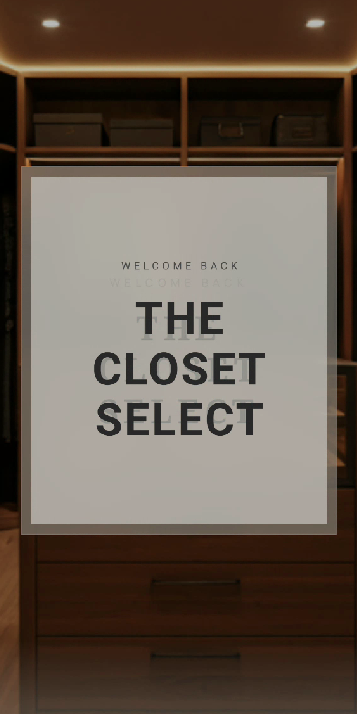
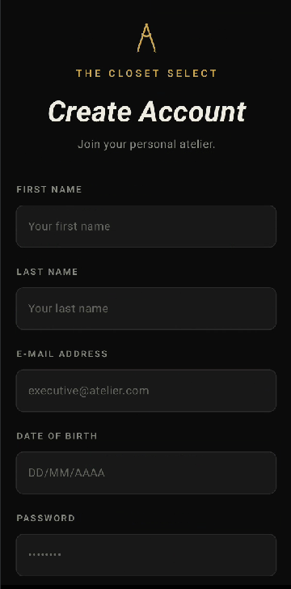
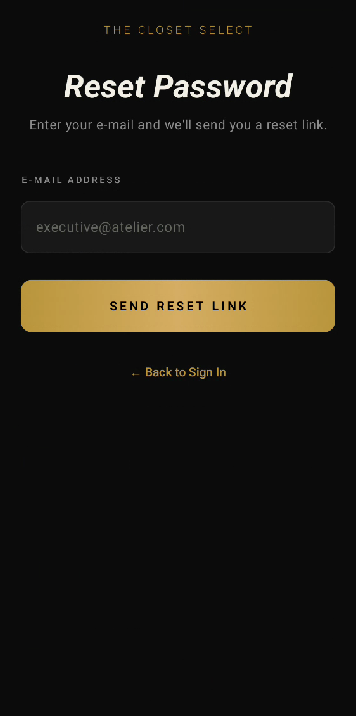
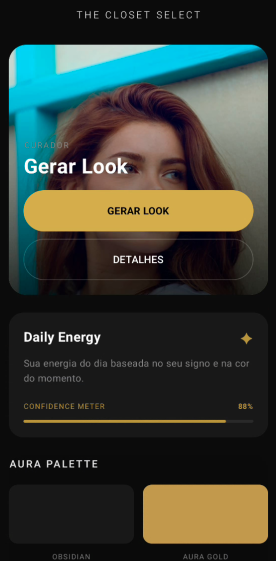
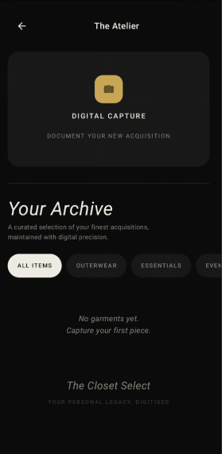

# 👗 The Closet Select


An Android app that delivers **context-aware outfit recommendations** by combining personal wardrobe data, weather conditions, color analysis, and AI.

---

## 🔍 Overview

- 📱 Android app built with Kotlin + Jetpack Compose  
- 🧠 AI-powered outfit generation (Google Gemini)  
- 🌤️ Real-time weather integration  
- 🎨 Personalized color palette system  
- 🔐 Firebase Authentication & Firestore backend  
- 🧱 Clean Architecture (Data / Domain / Presentation)  

---

## 💡 Concept

Getting dressed is often repetitive and disconnected from context.

**The Closet Select** transforms your wardrobe into an intelligent system that considers:

- Your available clothes  
- Current weather conditions  
- Personalized color palette  
- Context-aware signals (user profile + preferences)

Instead of generic suggestions, the app generates **highly personalized outfit combinations using your own wardrobe**.

---

## 🧱 Architecture

The project follows a **Clean Architecture approach**:

```text
data/
├── remote (API services)
├── model (DTOs)
├── repository (implementations)

domain/
├── model (business models)
├── repository (interfaces)
├── usecase (business logic)

presentation/
├── screens (feature-based UI)
├── navigation
├── components

🚀 Features
🔐 Firebase Authentication (Email/Password + Google Sign-In)
👤 User profile with automatic zodiac calculation
🌤️ Real-time weather (OpenWeather API)
🤖 AI-powered outfit generation (Gemini 2.5 Flash)
👗 Personal wardrobe archive with CameraX
🎨 Aura Palette (personalized color system)
✨ Daily context screen with confidence indicator
🔄 Real-time sync with Firestore
🌑 Premium dark UI with gold accents
🛠️ Tech Stack
Core
Kotlin
Jetpack Compose
MVVM + StateFlow
Clean Architecture
Backend & Services
Firebase Authentication
Firebase Firestore
Firebase Storage
APIs & AI
Google Gemini (AI)
OpenWeather API
Google Location Services
Libraries
Navigation Compose
Coil
CameraX
OkHttp
Kotlinx Serialization
Accompanist Permissions
📸 Screens
<p align="center">      </p>
